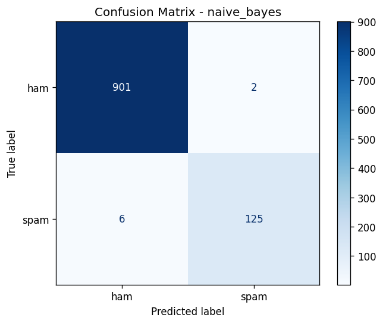

# Spam Email Classifier

Classifies messages as spam or ham using TF-IDF features with Multinomial Naive Bayes and Linear SVM.

## Results (SMS Spam Collection, 80/20 split)

| Model | Accuracy | Spam Precision | Spam Recall | Spam F1 |
|---|---|---|---|---|
| Naive Bayes | 0.992 | 0.98 | 0.95 | 0.97 |
| Linear SVM | 0.987 | 0.95 | 0.95 | 0.95 |



## Setup
```bash
pip install -r requirements.txt
```
Download the dataset (e.g. SMS Spam Collection from Kaggle) and save it as `data/spam.csv`. The CSV is not included in the repo.

## Usage
```bash
python src/train.py                 # trains both models, saves the best
python src/predict.py "Free prize! Click here to claim"
```

## Pipeline
1. Clean text (lowercase, replace URLs/emails/numbers, strip punctuation)
2. TF-IDF with unigrams and bigrams
3. Train Naive Bayes and SVM, compare by spam F1, save the best to `models/spam_model.joblib`